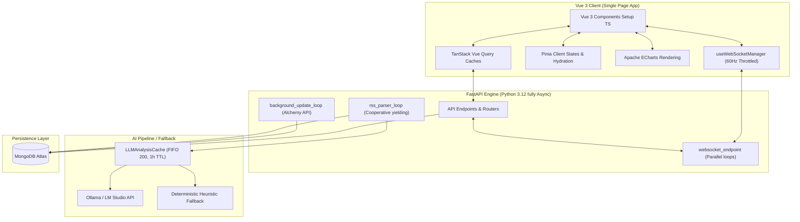

# 📊 Crypto-Market Sentiment Analyzer (TradingView-Style SPA)

<div align="center">

[](https://github.com)
[](https://vuejs.org)
[](https://fastapi.tiangolo.com)
[](https://www.mongodb.com)
[](https://www.typescriptlang.org)

**A high-frequency real-time cryptocurrency sentiment dashboard engineered for resilience under strict cloud free-tier constraints (Render & MongoDB Atlas).**

[Live Application Demo](http://localhost:8080) · [Backend API Sandbox](http://localhost:8000/docs) · [Report Bug](https://github.)

</div>

---

## 📖 Overview

The **Crypto-Market Sentiment Analyzer** is a production-ready, full-stack single page application (SPA) designed to track, aggregate, and visualize high-frequency market prices and real-time news sentiment for premier financial assets (BTC, ETH, TON, SOL, AAPL). 

The platform implements an advanced processing pipeline: real-time spot rates are synchronized from the **Alchemy Prices API** and **yfinance**, while search-based Google News RSS feeds are parsed in real time. Headlines and summaries undergo an in-memory AI sentiment evaluation using a local or external LLM (Ollama, LM Studio, or a deterministic fallback engine) to dynamically compute asset sentiment scores and drive reactive mock-market price changes.

To survive the extreme resource limits of **Render Free-Tier** (container sleeping, low RAM/CPU) and **MongoDB Atlas Free-Tier** (512 MB storage limit), the application was designed from the ground up using **extreme performance engineering and async-safe patterns**. 

---

## 🏗️ System Architecture

The following diagram highlights the asynchronous data pipeline, in-memory caching layers, and WebSocket isolation shields implemented across the full stack:



---

## 🎯 Key Architectural Milestones & Engineering Patterns

### 🎨 Frontend Advancements (Sprints 1–4)

*   **60Hz Paint-Cycle Throttled WebSocket Manager (`useWebSocketManager.ts`)**
    To prevent costly DOM reflow storms and micro-stutters during high-frequency market updates, the frontend client implements a custom WebSocket connection manager. It applies exponential backoff reconnection (capped at 30 seconds) and micro-throttles incoming tick messages using `requestAnimationFrame`. This aligns DOM updates directly with the browser's 60Hz paint cycle, guaranteeing zero UI frame drops.
*   **Active Reset Fault-Isolation Boundary (`WidgetWrapper.vue`)**
    Inspired by TradingView's micro-frontend stability, the dashboard isolates heavy components (e.g., Sentiment charts, Google News feeds) inside a custom `WidgetWrapper`. By capturing internal rendering or historical data parsing errors with Vue 3's `onErrorCaptured` hook, the parent container gracefully traps crashes. It shows a visual error overlay with a debug stack trace while keeping the rest of the application fully operational. Pressing "Reset Widget" increments a reactive `:key` binder, destroying the crashed component and instantiating a fresh one from scratch.
*   **Optimistic UI Watchlist with Automatic Rollback**
    Adding or removing assets to/from the user's watchlist triggers immediate local state modifications for a snappy UX feel. If the background API call fails (e.g., due to a temporary network drop), the system automatically rolls back the local state, flashes a premium glassmorphic Toast notification, and logs the detailed network transaction.
*   **LocalState Offline Hydration**
    To bypass Render's container sleeping cold start, the client Pinia store implements a hydration system. The last 50 cached Google News articles and watchlist items are instantly loaded from `localStorage` upon boot. This lets the user consume cached historical data immediately while the backend container wakes up in the background.

---

### ⚡ Backend Advancements (Sprints 1–4)

*   **Isolated Queue Client Connection Manager (`websocket_manager.py`)**
    To shield the server's single-threaded event loop from slow networks, the backend establishes private `asyncio.Queue` buffers (maximum size of 100 updates) for every connected client. Broadcasts are enqueued via a non-blocking `put_nowait()`. If a client's downstream lags, the manager's **Slow Client Shield** catches the `QueueFull` exception, pops and discards the oldest tick (`get_nowait()`), and enqueues the fresh message—maintaining constant memory footprints and eliminating downstream-induced event loop blocks.
*   **MongoDB Relative Offset Bucket Pattern (`database.py` & `market_data.py`)**
    High-frequency asset pricing is compressed into hourly documents inside the `ticks_buckets` collection. Instead of storing massive, repetitive, absolute BSON datetimes for every price update, the schema saves ticks as sub-documents using a relative `offset_seconds` integer relative to the parent hour's `bucket_start` ISO datetime. This reduces individual tick document sizes by **over 80%**, saving significant network bandwidth and DB storage.
*   **Atlas 48-Hour TTL Expiration & Compound Indexing**
    To guarantee the application never exceeds MongoDB Atlas's free 512 MB tier, a compound index is configured on `("asset_id", "bucket_start")` for rapid historical queries, combined with a collection-level **TTL Index** on `bucket_start` with an automatic 48-hour expiration (`expireAfterSeconds=172800`). Database garbage collection is managed hands-off by MongoDB's background threads.
*   **Cooperative Yielding & Time-Window RSS Deduplication (`parser.py`)**
    Google News parser sweeps run periodically. To prevent massive RSS ingestion spikes from hogging CPU, the parser inserts cooperative `await asyncio.sleep(0.5)` yields during sweeps, releasing event loop control to handle concurrent WebSocket connections. A sliding 15-minute window deduplicator (`_is_duplicate_in_window`) hashes parsed titles using MD5; duplicate syndications across multiple RSS channels are immediately discarded before querying the database or invoking LLM pipelines.
*   **In-Memory Semantic LLM Cache & Token Pre-Cleaning (`llm.py`)**
    Querying LLMs for news sentiment is resource-heavy and slow. We introduce an async-safe `LLMAnalysisCache` protected by `asyncio.Lock` that caches the last 200 unique articles with a 1-hour TTL. Before querying Ollama or LM Studio, a regex-based `clean_text` optimizer strips out raw HTML tags, absolute URLs, and boilerplate newsletter markers (e.g. *"All rights reserved"*, *"Click here to read more"*), reducing LLM prompt sizes by up to 40% and cutting inference latency.

---

## 🛡️ Hardening & Security Controls

This repository implements rigorous production-grade safety mechanisms:
*   **Direct Cryptographic Hashing**: Bypasses bloated or vulnerable third-party authentication wrappers in favor of direct, secure `bcrypt` salt and hash algorithms in `services/auth.py`.
*   **Strict Pydantic Password Validator**: Enforces strict password complexity criteria inside Pydantic schemas (at least 8 characters, containing at least one letter and at least one digit) using field-level decorators.
*   **Brute-Force Rate Limiting**: Employs `SlowAPI` middleware directly on high-risk `/auth/register` and `/auth/login` HTTP endpoints, capping requests at 10 per minute to stop dictionary attacks.
*   **Render Warmup Bypass Endpoint**: Implements a dedicated GET `/api/v1/healthz` endpoint. This route bypasses database and LLM handshakes entirely, returning a 200 OK instantly. Render uses this route to perform lightning-fast container warmups, keeping the app alive while avoiding connection timeouts.

---

## 📂 Project Layout & File Tree

The workspace is organized into highly isolated modules following strict Vue 3 Composition API rules and FastAPI's router partitioning:

```text
├── backend/                       # Python FastAPI Backend Project
│   ├── app/
│   │   ├── api/
│   │   │   ├── v1/
│   │   │   │   └── endpoints.py   # REST APIs & Real-time WebSocket room routers
│   │   │   └── dependencies.py    # FastAPI dependencies (JWT Auth, DB retrieval)
│   │   ├── core/
│   │   │   ├── config.py          # Pydantic-Settings environment loading
│   │   │   ├── database.py        # Motor Async MongoDB setup & Index registers
│   │   │   └── security.py        # JWT and Bcrypt token helpers
│   │   ├── schemas/
│   │   │   ├── auth.py            # User registration & token Pydantic models
│   │   │   └── market.py          # Assets, historical OHLCV, ticks bucket schemas
│   │   ├── services/
│   │   │   ├── auth.py            # Password verification & authentication logic
│   │   │   ├── llm.py             # LLM API query, regex token cleaner & FIFO cache
│   │   │   ├── market_data.py     # Database seed, historical candles, CG/yF feed
│   │   │   ├── parser.py          # RSS fetch, XML parsing & sliding deduplicator
│   │   │   └── websocket_manager.py # Isolated asyncio.Queue WebSocket manager
│   │   ├── tests/
│   │   │   ├── test_endpoints.py  # Test cases for JWT auth & healthz checks
│   │   │   ├── test_llm_cache.py  # Cache expiry and token pre-cleaner assertions
│   │   │   └── test_websocket_manager.py # Queue drops & connection room buffers
│   │   └── main.py                # App entrypoint, supervised tasks, CORS config
│   ├── Dockerfile                 # Light multi-stage Python container build
│   └── requirements.txt           # Explicitly pinned backend dependencies
│
├── frontend/                      # Vue 3 SPA Frontend Project
│   ├── src/
│   │   ├── components/
│   │   │   ├── dashboard/         # Metrics panel, Sentiment chart, Live news list
│   │   │   │   ├── SentimentChart.vue
│   │   │   │   └── WidgetWrapper.vue
│   │   │   ├── layout/            # Layout shell (Sidebar drawer, Header)
│   │   │   └── ui/                # Base design system components (Toasts, inputs)
│   │   ├── composables/           # Auto-imported Business Logic Composables
│   │   │   ├── useAppStore.ts     # Global client states using Pinia
│   │   │   ├── useAssetWebSocket.ts # WS updates feed to TanStack cache
│   │   │   └── useWebSocketManager.ts # Throttled requestAnimationFrame WS connection
│   │   ├── views/                 # Routed main layouts (Dashboard, Portfolio)
│   │   ├── App.vue                # Main app template & global error boundaries
│   │   └── main.ts                # App boot, Pinia, & Vue-Query initialization
│   ├── Dockerfile                 # Multi-stage production Nginx container build
│   ├── tailwind.config.js         # HSL custom variable colors & spacing setup
│   └── vite.config.ts             # Vite server routing, HMR, & chunk optimization
│
├── docker-compose.yml             # Single command multi-container orchestrator
└── README.md                      # Professional technical repository review
```

---

## ⚙️ Development Environment Setup

Get the full development stack up and running in minutes using Docker:

### Prerequisites
*   [Docker & Docker Compose](https://www.docker.com/products/docker-desktop) installed.
*   *Optional:* Ollama or LM Studio running locally if you want local AI analysis.

### Step-by-Step Installation

1.  **Clone the Repository** and navigate to the directory:
    ```bash
    git clone https://github.com/your-username/crypto-sentiment-analyzer.git
    cd crypto-sentiment-analyzer
    ```

2.  **Configure Environment Variables**
    Create a local environment file in the backend directory:
    ```bash
    cp backend/.env.example backend/.env
    ```
    Configure the variables in `backend/.env`. If you have Ollama running on your host machine, configure it as follows:
    ```env
    MONGODB_URL=mongodb://localhost:27017
    MONGODB_DB_NAME=sentiment_db
    LLM_API_URL=http://host.docker.internal:11434/v1
    LLM_MODEL=gemma:2b
    ALCHEMY_API_KEY=your_alchemy_key_here
    JWT_SECRET_KEY=generate_a_secure_hex_key_here
    ```
    > [!TIP]
    > To generate a secure 256-bit JWT secret, run this command in your terminal:
    > `python -c "import secrets; print(secrets.token_hex(32))"`

3.  **Orchestrate Container Startup**
    Use Docker Compose to build and launch all containers in detached mode:
    ```bash
    docker compose up --build -d
    ```
    This launches three services in harmony:
    *   **MongoDB**: Persistent database layer.
    *   **FastAPI Backend**: Port `8000`. Runs background updates, RSS feeds, and WebSocket channels.
    *   **Vue 3 Frontend**: Port `8080`. Single page application served through optimized dev server/nginx.

4.  **Verify In-Action**
    *   Open your browser to explore the dashboard: 👉 **[http://localhost:8080](http://localhost:8080)**
    *   Explore and interact with the FastAPI documentation: 👉 **[http://localhost:8000/docs](http://localhost:8000/docs)**

---

## 🛠️ Code Quality & Verification Gates

Strict, professional quality checks are enforced across both front-end and back-end stacks. No code is merged unless all gates pass with **zero warnings/errors**.

### 🎨 Frontend Verification (Vite, ESLint & TypeScript)

*   **Linting & Style Checks**:
    ```bash
    cd frontend
    npm run lint
    ```
*   **Production Build & Typing Compile**:
    ```bash
    npm run build
    ```
    *Result: Exits with code `0`, confirming complete TypeScript type-safety across all dynamic components.*

---

### ⚡ Backend Verification (Ruff, Mypy Strict & Pytest)

*   **Ruff Formatting & Quality Checks**:
    ```bash
    cd backend
    .venv/Scripts/python -m ruff check app --fix
    .venv/Scripts/python -m ruff format app
    ```
*   **Strict Mypy Type Verification**:
    Run Mypy with strict type-checking flags across the entire FastAPI package base:
    ```bash
    # Run from root directory to properly resolve imports
    $env:PYTHONPATH="c:\Users\krivo\Desktop\Rust\vue"
    .venv/Scripts/python -m mypy --strict -p backend.app
    ```
    *Result: `Success: no issues found in 26 source files` (100% type annotations coverage, no implicit `Any`).*

*   **Pytest Assertion Suite**:
    Run the asynchronous automated test suite:
    ```bash
    $env:PYTHONPATH="c:\Users\krivo\Desktop\Rust\vue"
    .venv/Scripts/pytest backend/app/tests/
    ```
    *Result: `14 passed in 0.50s` (testing WebSocket isolation drops, LLM caches, TTL indexes, and endpoints).*

---

## 🔮 Future Roadmap

*   **Semantic Clustering Ingestion**: Upgrade the textual RSS deduplicator to use a lightweight local Sentence-Transformers model to cluster news with semantically matching storylines.
*   **Cross-Asset Volatility Correlation Graphing**: Overlay ECharts visualizations to map sentiment volatility changes between crypto (BTC, ETH, SOL, TON) and traditional stock markets (AAPL).
*   **Decentralized Web3 Alerts**: Leverage Alchemy smart contract logs to broadcast real-time whale transactions (> $100k) directly into the sentiment analysis timeline.

---

## 📄 License

Distributed under the MIT License. See `LICENSE` for details.