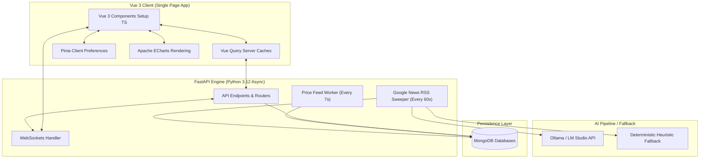

# 📊 LLM-Powered Market Sentiment Analyzer

<div align="center">


</div>

A premium, production-grade Full-Stack Web Application that aggregates financial asset metrics (BTC, ETH, SOL, AAPL) and processes real-time news feeds via an LLM sentiment analysis pipeline. Built with absolute focus on type safety, strict architectural boundaries, and modern industry standards.

---

## 🎯 Key Capabilities

*   **Real-time Metrics Dashboard**: Displays prices, 24h fluctuations, volume indexes, and sentiment scores.
*   **Dual-Axis Chart Overlay**: Visualizes price action via custom candlestick charts overlaid with a smoothed trendline of historical sentiment index scores.
*   **Asynchronous Google News Scraping**: Periodically pulls search-specific RSS feeds from Google News.
*   **Local LLM Sentiment Engine**: Connects to a local model (e.g., Ollama or LM Studio) to perform structured sentiment analysis on news headlines and summaries, with deterministic template fallbacks if no LLM is running.
*   **MongoDB Storage Layer**: Persists historical candles, assets, and processed articles using the asynchronous `motor` driver.
*   **Dynamic UI Experience**: Features beautiful fade-in entry animations for new articles in the feed, responsive sidebar components, and custom glow animations tailored to the active asset's sentiment.

---

## 🏗️ System Architecture



### Frontend (Vue 3 Single Page App)
*   **Framework**: Vue 3 (Composition API strictly using `<script setup lang="ts">`).
*   **Language**: TypeScript (Strict mode, `strict: true`, no `any` types).
*   **Data Fetching & State**: `@tanstack/vue-query` handles async cache management and background polling loops (every 7 seconds). Pinia manages client preferences.
*   **Visualization**: Apache ECharts (`vue-echarts`) renders price and sentiment overlays.
*   **Styling**: utility-first Tailwind CSS + Glassmorphism UI tokens with custom pulse-glow animations.

### Backend (FastAPI App)
*   **Framework**: FastAPI (Python 3.12, fully asynchronous IO).
*   **Data Access**: MongoDB client connection managed via `motor` async driver.
*   **Validation**: Pydantic v2 validation schemas.
*   **Task Workers**: Parallel background loops running price simulations (every 7 seconds) and fetching news articles (every 60 seconds).

---

## 🛡️ Security & Hardening Controls

This repository implements industry-standard safety defenses:
*   **Direct Cryptographic Hashing**: Employs raw `bcrypt` password salting and hashing rather than relying on legacy or bloated third-party wrapper wrappers, eliminating string length edge-cases.
*   **Strict Password Validation**: A custom Pydantic `@field_validator` guarantees that all user passwords meet secure complexity criteria (at least 8 characters, containing at least one letter and at least one digit).
*   **Brute-Force Attack Prevention**: Integrated `SlowAPI` limiters on the critical `/auth/register` and `/auth/login` endpoints, restricting requests to a maximum of 10 per minute to guard against credential stuffing and automated attacks.
*   **Convenient Escape Pathway**: Provided highly visible and accessible "Back to Dashboard" glassmorphism exit routes on both the sign-in and account creation panels, ensuring that guest users are never locked out of exploring market data.

---

## ⚙️ Development Environment Setup

The entire stack is containerized using **Docker** and orchestrated with **Docker Compose**.

### Prerequisites
*   Docker & Docker Compose installed.
*   (Optional) Ollama or LM Studio running on the host machine.

### Installation & Run

1.  Clone the repository and go to the project root directory.
2.  Configure your environment in `backend/.env` (based on [backend/.env.example](file:///c:/Users/krivo/Desktop/Rust/vue/backend/.env.example)):
    ```env
    MONGODB_URL=mongodb://localhost:27017
    MONGODB_DB_NAME=sentiment_db
    LLM_API_URL=http://host.docker.internal:11434/v1
    LLM_MODEL=gemma4:e4b
    ```
    *(Note: Using `host.docker.internal` allows the Docker container to access the LLM server running on your host machine's localhost.)*
3.  Launch the container stack:
    ```bash
    docker compose up --build -d
    ```
4.  Open the web app in your browser:
    👉 **`http://localhost:8080`**
5.  View the interactive backend API documentation:
    👉 **`http://localhost:8000/docs`**

---

## 🛠️ Code Quality Controls

This repository enforces strict clean-code gates:
*   **Python Formatting & Linting**: Checked and formatted via **Ruff**:
    ```bash
    cd backend
    .venv/Scripts/ruff check . --fix
    .venv/Scripts/ruff format .
    ```
*   **Strict Type Checks**: Verified via **Mypy**:
    ```bash
    # Execute from the workspace root to resolve package bases
    .venv/Scripts/mypy --strict --explicit-package-bases backend
    ```
*   **Automated Test Suite**: Pytest assertions covering API endpoints and health checks:
    ```bash
    $env:PYTHONPATH="."
    .venv/Scripts/pytest
    ```
*   **Database Admin Script**: Wipe and reseeding tool:
    ```bash
    .venv/Scripts/python backend/scripts/clear_db.py
    ```